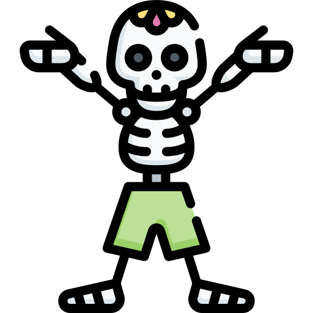

<p align="center">
  
</p>


# Skeleton PHP


A skeleton for modern PHP development, providing a clean structure and essential tooling.


## 🚀 Features
- PSR-4 autoloading
- Pest for testing
- Laravel Pint for code formatting
- PHPStan for static analysis
- Rector for code refactoring

## 🛠 Usage


### Lint Code
```sh
composer lint
```

### Run Unit Test
```sh
composer test:unit
```

### Static Analysis
```sh
composer test:types
```

### Test Code Format
```sh
composer test:lint
```

### Run Everything
```sh
composer test
```

## 🏗 Folder Structure
```
src/                # Main source code
tests/              # Unit and feature tests
```

## ✨ Example Implementation

### Greeting Contract
```php
<?php
declare(strict_types=1);

namespace RoyRakesh\SkeletonPhp\Contracts;

interface GreetingContract
{
    public function greet(string $name): string;
}
```

### Greeting Service
```php

<?php
declare(strict_types=1);

namespace RoyRakesh\SkeletonPhp\Services;

use RoyRakesh\SkeletonPhp\Contracts\GreetingContract;

class GreetingService implements GreetingContract
{
    public function greet(string $name): string
    {
        return "Hello, $name!";
    }
}
```

### Greeting Class
```php

<?php
declare(strict_types=1);

namespace RoyRakesh\SkeletonPhp;

use RoyRakesh\SkeletonPhp\Services\GreetingService;

final class Greeting
{
    private GreetingService $greetingService;

    public function __construct()
    {
        $this->greetingService = new GreetingService();
    }

    public function greet(string $name): string
    {
        return $this->greetingService->greet($name);
    }
}
```

### Pest Test for GreetingService
```php
<?php

declare(strict_types=1);

use RoyRakesh\SkeletonPhp\Services\GreetingService;

it('returns a greeting message', function () {
    $service = new GreetingService();

    expect($service->greet('Rakesh'))->toBe('Hello, Rakesh!');
});
```

### Pest Test for Greeting
```php
<?php

declare(strict_types=1);

use RoyRakesh\SkeletonPhp\Greeting;

it('greets a user with a name', function () {
    $greeting = new Greeting();

    $result = $greeting->greet('Rakesh');

    expect($result)->toBe('Hello, Rakesh!');
});

it('greets a user with an empty name', function () {
    $greeting = new Greeting();

    $result = $greeting->greet('');

    expect($result)->toBe('Hello, !'); 
});
```

## 🔗 Credits
This package utilizes the following open-source tools:
- [PestPHP](https://pestphp.com/) - A modern PHP testing framework.
- [Laravel Pint](https://github.com/laravel/pint) - An opinionated PHP code formatter.
- [PHPStan](https://phpstan.org/) - Static analysis tool for PHP.
- [Rector](https://github.com/rectorphp/rector) - Automated code refactoring tool.

## 📝 License
This project is licensed under the MIT License.

## 👤 Author
**Rakesh Roy**  
[Website](https://royrakesh.dev) | [Email](mailto:royrakesh.cob@gmail.com)

